# Objektinis programavimas
Šis tyrimas skirtas įvertinti C++ programos veikimo spartą, kuri vykdo studentų duomenų apdorojimą: failų generavimą, nuskaitymą, studentų rūšiavimą į dvi grupes bei rezultatų išvedimą į atskirus failus.

**Testavimai atlikti kompiuteryje su šia konfigūracija:**
- Procesorius (CPU): Intel i5-11300H (3.1 GHz, 11th Gen);
- RAM: 8 GB
- SSD: Intel 660p
- OS: Windows 10
- Kompiliatorius: Clang++ (LLVM), C++20 standartas

Tyrimai atlikti naudojant šią aparatūrą ir programinę įrangą, kuri užtikrina pakankamą našumą duomenų apdorojimo užduotims. Naudojamas Clang++ kompiliatorius su C++20 standartu leidžia efektyviai išnaudoti modernias kalbos galimybes.

**1 tyrimas. Failų kūrimas ir jo uždarymas**
-

**Tikslas:** įvertinti, kiek laiko užtrunka sugeneruoti skirtingo dydžio duomenų failus.

**Tyrimo eiga:**
- Vartotojas įveda failo pavadinimą, studentų ir pažymių kiekį;
- Laiko matavimas prasideda po vartotojo įvesties;
- Programa sugeneruoja duomenų failą su atsitiktiniais vardais, pavardėmis ir pažymiais;
- Laiko matavimas baigiamas užbaigus failo generavimą;
- Išvedamas sugeneravimo laikas sekundėmis, reprezentuojantis programos spartą failo kūrimui pagal pasirinktus parametrus.

**Gauti rezultatai:**

1. Studentų: 1000, pazymių: 10;

2. Studentų: 10000, pazymių: 10;

3. Studentų: 100000, pazymių: 10;

4. Studentų: 1000000, pazymių: 10;

5. Studentų: 10000000, pazymių: 10;

**Lentele:**

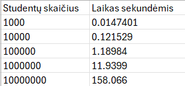

**Išvada**: Failo generavimo trukmė didėja proporcingai duomenų kiekiui, o tai rodo gerą programos efektyvumą. Programa išlieka naši net ir su labai dideliais įrašų kiekiais – 10 milijonų įrašų sugeneruota per mažiau nei 3 minutes.

**2 tyrimas. Duomenų apdorojimo našumo tyrimas (std::vector)**
-

**Tikslas:** Įvertinti programos spartą atliekant pilną duomenų apdorojimo procesą: duomenų nuskaitymą iš jau sugeneruoto failo, studentų rūšiavimą į dvi kategorijas, duomenų išvedimą į atskirus failus.

**Tyrimo eiga:**
- Vartotojas įveda: failo pavadinimą, iš kurio bus nuskaitomi duomenys, dviejų rezultatinių failų pavadinimus (vargšiukams ir kietiakams), pasirinkimą, pagal kokį kriterijų skirstyti studentus;
- Laiko matavimas prasideda po vartotojo įvesties;
- Programa nuskaito studentų įrašus į atmintį;
- Studentai suskirstomi į dvi grupes (vargšiukus ir kietiakus);
- Kiekviena grupė išvedama į atskirą failą;
- Laiko matavimas baigiamas užbaigus įrašymą;
- Išvedami laiko rezultatai sekundėmis.

**Gauti rezultatai:**

1. Studentų: 1000, pažymių: 10;

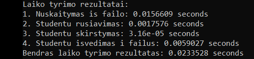

2. Studentų: 10000, pažymių: 10;

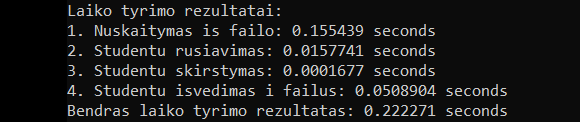

3. Studentų: 100000, pažymių: 10;

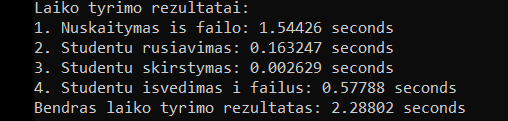

4. Studentų: 1000000, pažymių: 10;

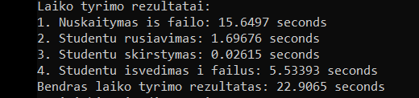

5. Studentų: 10000000, pažymių: 10;

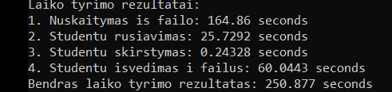

**Lentele:**

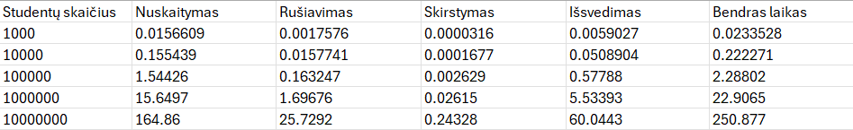

**Išvada:**
Nuskaitymas ir išvedimas užima daugiausia laiko, ypač su dideliais duomenų kiekiais. Tai rodo, kad programos sparta ribojama ne algoritmo efektyvumo, o kietojo disko įvesties/išvesties greičio. Tuo tarpu rūšiavimo ir skirstymo operacijos vykdomos itin sparčiai, todėl galima teigti, kad pati algoritmo logika yra efektyvi.

**3 tyrimas. Duomenų apdorojimo našumo tyrimas su std::list ir std::deque**
-
**Tikslas:** Palyginti std::vector, std::list ir std::deque konteinerių našumą, atliekant duomenų nuskaitymą, rūšiavimą ir skirstymą į grupes.

**Tyrimo eiga:** Išlieka identiška kaip ir antrajame tyrime – duomenys į programą įkeliami iš tų pačių failų, atliekami tie patys veiksmai ta pačia seka: duomenų nuskaitymas, studentų rūšiavimas bei skirstymas į dvi grupes.

**Gauti rezultatai (std::list):**

1. Studentų: 1000, pažymių: 10;

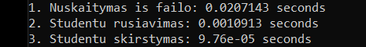

2. Studentų: 10000, pažymių: 10;

3. Studentų: 100000, pažymių: 10;

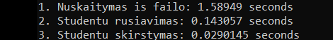

4. Studentų: 1000000, pažymių: 10;

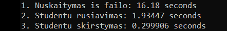

5. Studentų: 10000000, pažymių: 10;

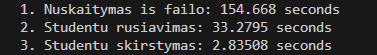

**Lentele:**

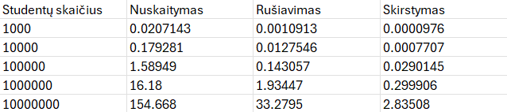

**Gauti rezultatai (std::deque):**

1. Studentų: 1000, pažymių: 10;

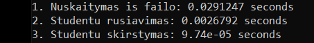

2. Studentų: 10000, pažymių: 10;

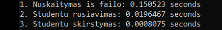

3. Studentų: 100000, pažymių: 10;

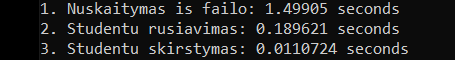

4. Studentų: 1000000, pažymių: 10;

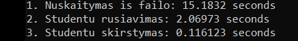

5. Studentų: 10000000, pažymių: 10;

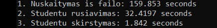

**Lentele:**

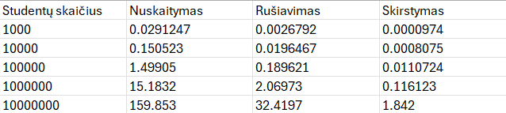

**Išvada:**
Remiantis atliktais matavimais, std::deque konteineris buvo pastebimai greitesnis atliekant skirstymo operacijas, ypač esant dideliems duomenų kiekiams, o rūšiavimo ir nuskaitymo greičiai tarp std::list ir std::deque buvo panašūs.

**2 ir 3 tyrimo bendra analize**
-
**Nuskaitymas**

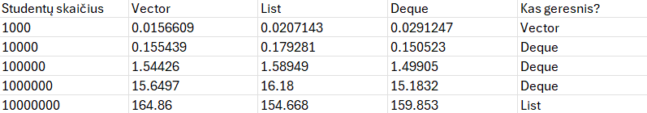

**Išvada:**
Nors teoriškai std::vector dažniausiai laikomas greičiausiu nuskaitymui, tyrimas parodė netikėtą rezultatą: su 10 milijonų elementų std::list veikė sparčiausiai. Kitais atvejais, std::vector ir std::deque demonstravo našumą.

**Rušiavimas**

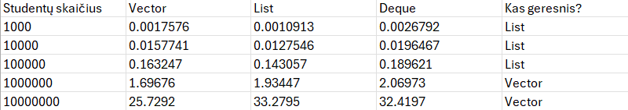

**Išvada:**
Rūšiavimui mažesniais ir vidutiniais duomenų kiekiais (iki ~100 000) efektyvesnis yra std::list. Tačiau didėjant duomenų kiekiui (virš 1 000 000) dėl geresnės atminties lokalumo ir efektyvesnių algoritmų naudojimo, std::vector tampa žymiai greitesnis.

**Skirstymas**

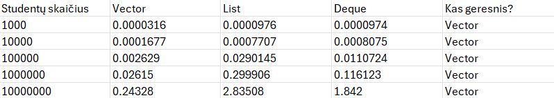

**Išvada:**
Skirstymo operacijos rezultatai yra labai aiškūs: std::vector buvo greičiausias visais testuotais duomenų kiekiais, ir jo pranašumas ypač išryškėjo didėjant elementų skaičiui. Tai rodo, kad programa efektyviausiai išnaudojo std::vector savybes – tvarkingą studentų laikymą atmintyje (vieną šalia kito) ir galimybę greitai pasiekti bet kurį reikiamą studentą.

### Autorius 
Rokas Venckus